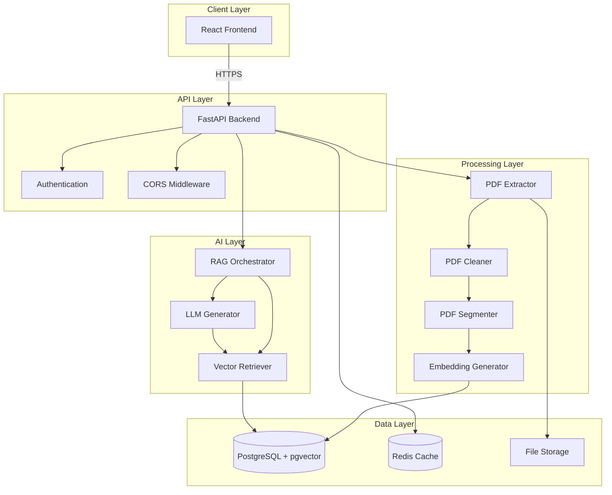
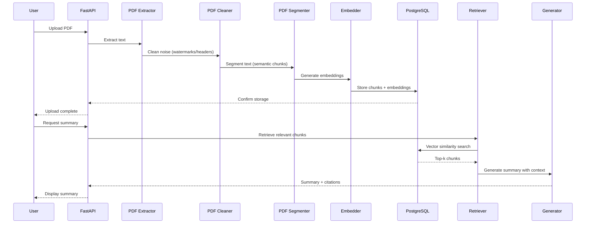

# System Architecture

High-level system design for the AI Lecture Note Summarizer application.

## Architecture Overview

The system follows a **microservices-inspired architecture** with clear separation of concerns, implementing a **Retrieval-Augmented Generation (RAG) pipeline** for intelligent document summarization.



---

## Component Interactions

### 1. Frontend (React)

**Responsibilities:**

- User interface for document upload and management
- Display summarization results with citations
- Real-time progress feedback during processing
- Search interface for semantic document retrieval

**Technology Justification:**

- **React 18+**: Modern hooks-based architecture, server components support
- **Functional Components**: Simplified state management, better performance
- **React Query**: Efficient server state management, automatic caching
- **TypeScript**: Type safety reduces runtime errors

**Communication:**

- REST API calls to FastAPI backend
- WebSocket connection for real-time processing updates
- Optimistic UI updates for better UX

### 2. Backend (FastAPI)

**Responsibilities:**

- RESTful API endpoints for all operations
- Request validation and error handling
- Business logic orchestration
- Background task management
- Authentication and authorization

**Technology Justification:**

- **FastAPI**: High performance, automatic OpenAPI docs, async support
- **Async/Await**: Non-blocking I/O for concurrent request handling
- **Pydantic**: Runtime type validation, automatic serialization
- **Dependency Injection**: Clean architecture, testable code

**Key Patterns:**

- **Repository Pattern**: Data access abstraction
- **Service Layer**: Business logic separation
- **Dependency Injection**: Loose coupling, easy testing
- **Background Tasks**: Long-running operations don't block responses

### 3. Database (PostgreSQL + pgvector)

**Responsibilities:**

- Structured data storage (users, documents, metadata)
- Vector embeddings storage and similarity search
- ACID transactions for data integrity
- Full-text search capabilities

**Technology Justification:**

- **PostgreSQL**: Mature, reliable, ACID compliant
- **pgvector**: Native vector operations, HNSW indexing
- **Unified Stack**: Single database for relational + vector data
- **Connection Pooling**: Efficient resource utilization

**Schema Design:**

```sql
-- Documents table
documents (
    id UUID PRIMARY KEY,
    user_id UUID REFERENCES users(id),
    filename TEXT,
    file_path TEXT,
    upload_date TIMESTAMP,
    metadata JSONB
)

-- Chunks table with embeddings
chunks (
    id UUID PRIMARY KEY,
    document_id UUID REFERENCES documents(id),
    content TEXT,
    embedding VECTOR(384),  -- Sentence-transformer dimension
    chunk_index INTEGER,
    metadata JSONB
)

-- HNSW index for fast similarity search
CREATE INDEX ON chunks USING hnsw (embedding vector_cosine_ops);
```

### 4. AI Pipeline (RAG)

**Responsibilities:**

- Document preprocessing and cleaning
- Semantic text segmentation
- Embedding generation
- Semantic retrieval
- Context-aware summarization
- Citation generation

**RAG Pipeline Flow:**



**Technology Justification:**

**Cleaning Strategy:**

- **Fuzzy Matching**: Detects repeated headers and footers across pages.
- **Pattern Recognition**: Identifies watermarks (e.g., "DRAFT") and page numbers.
- **Artifact Removal**: Cleans formatting remnants and orphaned bullets.

**Segmentation Strategy:**

- **Semantic Chunking**: Respects sentence boundaries and paragraph breaks.
- **Chunk Size**: 512 tokens (target) with configurable overlap (10%).
- **SpaCy**: Advanced sentence boundary detection.
- **Deterministic**: ID generation based on content hash.

**Embedding Models:**

- **sentence-transformers/all-MiniLM-L6-v2**: Fast, 384 dimensions, good quality
- **Alternative**: all-mpnet-base-v2 for higher accuracy (768 dimensions)
- **Fine-tuning**: Domain adaptation for academic content

**Retrieval Strategy:**

- **Hybrid Search**: Vector similarity + keyword matching (BM25)
- **Reranking**: Cross-encoder for relevance refinement
- **Top-k**: Retrieve 10-20 chunks, rerank to top 5
- **Metadata Filtering**: Filter by document, date, category

**Generation Strategy:**

- **Model**: Open-source LLM (e.g., Llama 2, Mistral)
- **Prompt Engineering**: Explicit instructions to use only provided context
- **Citation Tracking**: Link generated text to source chunks
- **Summarization Modes**: Extractive + Abstractive hybrid

---

## Data Flow

### Document Ingestion Flow

1. **Upload**: User uploads PDF via frontend
2. **Validation**: Backend validates file type, size, permissions (50MB Limit)
3. **Storage**: Save original file to storage system
4. **Extraction**: Hybrid approach with PyMuPDF/pdfplumber
5. **Cleaning**: Remove headers, footers, and watermarks via `PDFCleaner`
6. **Normalization**: Unicode NFC normalization and whitespace management
7. **Segmentation**: `PDFSegmenter` creates semantically coherent chunks
8. **Embedding**: Generate vector embeddings for each chunk
9. **Storage**: Store chunks + embeddings in PostgreSQL
10. **Indexing**: HNSW index automatically updated
11. **Notification**: User notified of completion

### Query & Summarization Flow

1. **Query**: User requests summary or asks question
2. **Query Transformation**: Rewrite query for better retrieval
3. **Embedding**: Generate query embedding
4. **Retrieval**: Vector similarity search in pgvector
5. **Filtering**: Apply metadata filters if specified
6. **Reranking**: Cross-encoder reranks retrieved chunks
7. **Context Assembly**: Combine top chunks into context
8. **Generation**: LLM generates summary with citations
9. **Post-processing**: Format output, extract citations
10. **Response**: Return summary with source references

---

## Architectural Patterns

### 1. API-First Design

- All functionality exposed via REST API
- OpenAPI specification auto-generated
- Frontend is just one possible client
- Enables mobile apps, CLI tools, integrations

### 2. Event-Driven Processing

- Background tasks for long-running operations
- Celery for distributed task queue (future)
- WebSocket for real-time progress updates
- Async processing prevents blocking

### 3. Layered Architecture

```
Presentation Layer (Frontend)
    ↓
API Layer (FastAPI Routes)
    ↓
Service Layer (Business Logic)
    ↓
Repository Layer (Data Access)
    ↓
Data Layer (PostgreSQL, Redis)
```

### 4. Dependency Injection

- Services injected via FastAPI dependencies
- Easy mocking for testing
- Loose coupling between components
- Configuration-driven behavior

---

## Scalability Considerations

### Horizontal Scaling

**Backend:**

- Stateless API servers behind load balancer
- Session data in Redis for shared state
- Multiple Uvicorn workers per instance
- Gunicorn process manager for production

**Database:**

- Connection pooling (SQLAlchemy async pool)
- Read replicas for query scaling
- Partitioning for large tables (by date, user)
- Caching layer (Redis) for frequent queries

**AI Pipeline:**

- Batch embedding generation
- Model serving via separate service (future)
- GPU acceleration for embeddings
- Caching for common queries

### Performance Optimization

**Caching Strategy:**

- **Redis**: Query results, embeddings, session data
- **Application-level**: Frequently accessed documents
- **CDN**: Static frontend assets
- **Database**: Materialized views for analytics

**Database Optimization:**

- **Indexes**: HNSW for vectors, B-tree for metadata
- **Query Optimization**: EXPLAIN ANALYZE for tuning
- **Vacuum**: Regular maintenance for index health
- **Partitioning**: Time-based or user-based partitions

**API Optimization:**

- **Async I/O**: Non-blocking database and external calls
- **Connection Pooling**: Reuse database connections
- **Pagination**: Limit result set sizes
- **Compression**: Gzip response compression

---

## Security Architecture

### Authentication & Authorization

- JWT-based authentication
- Role-based access control (RBAC)
- API key support for programmatic access
- Rate limiting per user/IP

### Data Security

- Encryption at rest (database)
- Encryption in transit (HTTPS/TLS)
- PII redaction in logs
- Secure file storage with access controls

### API Security

- CORS configuration
- Input validation (Pydantic)
- SQL injection prevention (ORM)
- XSS protection (sanitization)

---

## Technology Stack Summary

| Component | Technology | Justification |
|-----------|-----------|---------------|
| **Backend** | FastAPI | High performance, async, auto docs |
| **Frontend** | React 18+ | Modern, component-based, large ecosystem |
| **Database** | PostgreSQL | ACID, mature, pgvector support |
| **Vector Search** | pgvector | Native integration, HNSW indexing |
| **Caching** | Redis | Fast, versatile, pub/sub support |
| **Embeddings** | sentence-transformers | Quality, speed, easy deployment |
| **LLM** | Open-source (Llama/Mistral) | Privacy, cost, customization |
| **Testing** | pytest | Powerful, extensive plugins |
| **Containerization** | Docker | Consistency, isolation, portability |

---

## Future Enhancements

### Phase 2 Features

- **Multi-modal**: Support images, diagrams in PDFs
- **Collaborative**: Shared documents and annotations
- **Advanced RAG**: Query decomposition, self-reflection
- **Analytics**: Usage tracking, quality metrics

### Scalability Improvements

- **Kubernetes**: Container orchestration
- **Message Queue**: RabbitMQ/Kafka for event streaming
- **Microservices**: Split into smaller services
- **Dedicated Vector DB**: Migrate to Qdrant/Weaviate if needed

---

## References

- [FastAPI Best Practices](https://fastapi.tiangolo.com/tutorial/)
- [pgvector Documentation](https://github.com/pgvector/pgvector)
- [RAG Best Practices 2024](https://www.louisbouchard.ai/rag-techniques/)
- [React Server Components](https://react.dev/blog/2023/03/22/react-labs-what-we-have-been-working-on-march-2023)
