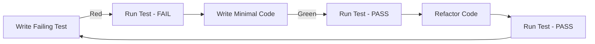

# Testing Strategy

Comprehensive testing philosophy and implementation guide for the AI Lecture Note Summarizer project.

## Testing Philosophy: Break-First Approach

> [!CAUTION]
> **Immutable Testing Principle**
>
> Tests are designed to **intentionally break the system** and expose weaknesses. Once a test is written:
>
> - Tests are **NEVER** weakened or modified to pass
> - Tests are **NEVER** deleted because they fail
> - The codebase **MUST ALWAYS** be changed to satisfy failing tests
>
> This is a strict, non-negotiable requirement.

### Core Principles

1. **Tests Define Correctness**: Tests are the source of truth for expected behavior
2. **Fail Fast**: Tests should fail immediately when behavior deviates
3. **No Compromises**: Never adjust tests to accommodate poor implementation
4. **Comprehensive Coverage**: Test edge cases, error conditions, and happy paths
5. **Isolation**: Each test is independent and can run in any order

---

## Test Pyramid

```
        /\
       /  \
      / E2E \          ← 10% (Slow, Brittle, High Value)
     /______\
    /        \
   /Integration\       ← 20% (Medium Speed, Medium Value)
  /____________\
 /              \
/  Unit Tests    \     ← 70% (Fast, Stable, High Volume)
/________________\
```

### Unit Tests (70%)

- **Scope**: Individual functions, classes, methods
- **Speed**: < 1ms per test
- **Isolation**: Mock all external dependencies
- **Coverage**: All code paths, edge cases, error conditions

### Integration Tests (20%)

- **Scope**: Component interactions, database operations
- **Speed**: < 100ms per test
- **Isolation**: Real database (test instance), mocked external APIs
- **Coverage**: API endpoints, service layer, repository layer

### End-to-End Tests (10%)

- **Scope**: Complete user workflows
- **Speed**: < 5s per test
- **Isolation**: Full stack (frontend + backend + database)
- **Coverage**: Critical user journeys

---

## Test-Driven Development (TDD)

### Red-Green-Refactor Cycle



### TDD Workflow

1. **Red Phase**: Write a test that fails
   - Confirms test can detect errors
   - Defines expected behavior
   - Documents requirements

2. **Green Phase**: Write minimal code to pass
   - Simplest implementation that works
   - No premature optimization
   - Focus on correctness

3. **Refactor Phase**: Improve code quality
   - Clean up implementation
   - Remove duplication
   - Improve readability
   - **Tests must still pass**

---

## Correctness First, Speed Second

### Priority Hierarchy

1. **Correctness**: Tests must accurately verify behavior
2. **Reliability**: Tests must be deterministic and stable
3. **Maintainability**: Tests must be readable and understandable
4. **Speed**: Tests should run as fast as possible **without compromising 1-3**

### Optimization Strategy

**Only optimize test speed after ensuring:**

- ✅ All tests pass consistently
- ✅ Tests cover all critical paths
- ✅ Tests are well-organized and readable
- ✅ Tests catch real bugs

---

## Speed Optimization Techniques

### 1. Parallel Execution (pytest-xdist)

**Installation:**

```bash
pip install pytest-xdist
```

**Usage:**

```bash
# Auto-detect CPU cores
pytest -n auto

# Specify number of workers
pytest -n 4

# Distribute by test file
pytest -n auto --dist loadfile

# Distribute by test function
pytest -n auto --dist loadscope
```

**Best Practices:**

- Use `loadfile` for faster startup
- Use `loadscope` for better load balancing
- Ensure tests are isolated (no shared state)
- Use fixtures with appropriate scopes

### 2. Fixture Optimization

**Fixture Scopes:**

```python
import pytest

# Function scope (default) - runs for each test
@pytest.fixture
def user():
    return create_user()

# Class scope - runs once per test class
@pytest.fixture(scope="class")
def database_connection():
    conn = create_connection()
    yield conn
    conn.close()

# Module scope - runs once per test file
@pytest.fixture(scope="module")
def embedding_model():
    model = load_model()  # Expensive operation
    yield model
    del model

# Session scope - runs once per test session
@pytest.fixture(scope="session")
def docker_services():
    start_docker_compose()
    yield
    stop_docker_compose()
```

**Optimization Rules:**

- **Expensive operations**: Use wider scopes (module, session)
- **Stateful operations**: Use narrower scopes (function, class)
- **Database fixtures**: Use transaction rollback for speed

### 3. Test Isolation

**Database Isolation:**

```python
import pytest
from sqlalchemy.orm import Session

@pytest.fixture
def db_session():
    """Provide a transactional scope for tests."""
    connection = engine.connect()
    transaction = connection.begin()
    session = Session(bind=connection)
    
    yield session
    
    session.close()
    transaction.rollback()  # Rollback all changes
    connection.close()
```

**File System Isolation:**

```python
import pytest
from pathlib import Path

@pytest.fixture
def temp_upload_dir(tmp_path):
    """Provide isolated temporary directory."""
    upload_dir = tmp_path / "uploads"
    upload_dir.mkdir()
    yield upload_dir
    # Automatic cleanup by pytest
```

### 4. Mocking Boundaries

**Mock External Dependencies:**

```python
import pytest
from unittest.mock import Mock, patch

# Mock expensive AI model
@pytest.fixture
def mock_embedding_model():
    with patch('app.services.embeddings.SentenceTransformer') as mock:
        mock.return_value.encode.return_value = [[0.1] * 384]
        yield mock

# Mock external API calls
@pytest.fixture
def mock_openai_api():
    with patch('openai.ChatCompletion.create') as mock:
        mock.return_value = {"choices": [{"message": {"content": "Summary"}}]}
        yield mock
```

**Mocking Guidelines:**

- Mock at service boundaries, not internal logic
- Use real implementations for unit under test
- Mock slow operations (API calls, model inference)
- Don't mock database in integration tests

### 5. Selective Test Execution

**Markers for Test Categories:**

```python
import pytest

# Mark slow tests
@pytest.mark.slow
def test_full_document_processing():
    pass

# Mark integration tests
@pytest.mark.integration
def test_api_endpoint_with_database():
    pass

# Mark unit tests
@pytest.mark.unit
def test_chunk_text_function():
    pass
```

**Run Specific Categories:**

```bash
# Run only fast tests
pytest -m "not slow"

# Run only unit tests
pytest -m unit

# Run integration tests
pytest -m integration

# Skip slow tests during development
pytest -m "not slow and not integration"
```

---

## Testing Standards

### Test Naming Convention

```python
# Pattern: test_<function>_<scenario>_<expected_result>

def test_chunk_text_with_valid_input_returns_chunks():
    """Test that chunk_text returns list of chunks for valid input."""
    pass

def test_chunk_text_with_empty_string_raises_value_error():
    """Test that chunk_text raises ValueError for empty input."""
    pass

def test_generate_embedding_with_long_text_truncates_to_max_length():
    """Test that generate_embedding handles text longer than max tokens."""
    pass
```

### Assertion Patterns

**Use Specific Assertions:**

```python
# ❌ Bad: Generic assertion
assert result

# ✅ Good: Specific assertion
assert len(result) == 5
assert isinstance(result, list)
assert all(isinstance(chunk, str) for chunk in result)
```

**Test Error Conditions:**

```python
import pytest

# ❌ Bad: Not testing error
def test_invalid_input():
    process_document(None)

# ✅ Good: Explicit error testing
def test_process_document_with_none_raises_type_error():
    with pytest.raises(TypeError, match="Document cannot be None"):
        process_document(None)
```

### Test Structure (Arrange-Act-Assert)

```python
def test_create_user_with_valid_data_returns_user():
    # Arrange: Set up test data
    user_data = {
        "email": "test@example.com",
        "password": "secure_password"
    }
    
    # Act: Execute the function under test
    user = create_user(user_data)
    
    # Assert: Verify the results
    assert user.email == "test@example.com"
    assert user.password != "secure_password"  # Should be hashed
    assert user.id is not None
```

---

## Test Coverage

### Coverage Goals

- **Overall**: 90%+ code coverage
- **Critical Paths**: 100% coverage (auth, data processing, AI pipeline)
- **Edge Cases**: Explicit tests for all error conditions
- **Integration**: All API endpoints covered

### Coverage Measurement

```bash
# Install coverage
pip install pytest-cov

# Run tests with coverage
pytest --cov=app --cov-report=html --cov-report=term

# View HTML report
open htmlcov/index.html

# Fail if coverage below threshold
pytest --cov=app --cov-fail-under=90
```

---

## CI/CD Integration

### GitHub Actions Workflow

```yaml
name: Test Suite

on: [push, pull_request]

jobs:
  test:
    runs-on: ubuntu-latest
    
    services:
      postgres:
        image: pgvector/pgvector:pg16
        env:
          POSTGRES_PASSWORD: postgres
        options: >-
          --health-cmd pg_isready
          --health-interval 10s
          --health-timeout 5s
          --health-retries 5
    
    steps:
      - uses: actions/checkout@v3
      
      - name: Set up Python
        uses: actions/setup-python@v4
        with:
          python-version: '3.11'
      
      - name: Install dependencies
        run: |
          pip install -r backend/requirements.txt
          pip install pytest-cov pytest-xdist
      
      - name: Run tests
        run: |
          pytest -n auto --cov=app --cov-fail-under=90
      
      - name: Upload coverage
        uses: codecov/codecov-action@v3
```

---

## Test Organization

### Directory Structure

```
backend/
├── tests/
│   ├── unit/
│   │   ├── test_chunking.py
│   │   ├── test_embeddings.py
│   │   └── test_utils.py
│   ├── integration/
│   │   ├── test_api_documents.py
│   │   ├── test_database.py
│   │   └── test_rag_pipeline.py
│   ├── e2e/
│   │   └── test_user_workflows.py
│   ├── conftest.py  # Shared fixtures
│   └── pytest.ini   # Configuration
```

### pytest Configuration

```ini
# pytest.ini
[pytest]
testpaths = tests
python_files = test_*.py
python_classes = Test*
python_functions = test_*

markers =
    unit: Unit tests
    integration: Integration tests
    e2e: End-to-end tests
    slow: Slow tests (> 1s)

addopts =
    -v
    --strict-markers
    --tb=short
    --disable-warnings
```

---

## Example Test Suite

### Unit Test Example

```python
import pytest
from app.services.chunking import chunk_text

class TestChunkText:
    """Test suite for chunk_text function."""
    
    def test_chunk_text_with_short_text_returns_single_chunk(self):
        """Short text should return a single chunk."""
        text = "This is a short sentence."
        chunks = chunk_text(text, chunk_size=100)
        
        assert len(chunks) == 1
        assert chunks[0] == text
    
    def test_chunk_text_with_long_text_returns_multiple_chunks(self):
        """Long text should be split into multiple chunks."""
        text = "A " * 1000  # 1000 words
        chunks = chunk_text(text, chunk_size=100)
        
        assert len(chunks) > 1
        assert all(len(chunk.split()) <= 100 for chunk in chunks)
    
    def test_chunk_text_with_overlap_preserves_context(self):
        """Chunks should overlap to preserve context."""
        text = "Sentence one. Sentence two. Sentence three."
        chunks = chunk_text(text, chunk_size=20, overlap=10)
        
        # Verify overlap exists
        assert len(chunks) >= 2
        # Check that adjacent chunks share content
        for i in range(len(chunks) - 1):
            assert any(word in chunks[i+1] for word in chunks[i].split())
    
    def test_chunk_text_with_empty_string_raises_value_error(self):
        """Empty input should raise ValueError."""
        with pytest.raises(ValueError, match="Text cannot be empty"):
            chunk_text("")
    
    def test_chunk_text_with_none_raises_type_error(self):
        """None input should raise TypeError."""
        with pytest.raises(TypeError, match="Text must be a string"):
            chunk_text(None)
```

### Integration Test Example

```python
import pytest
from fastapi.testclient import TestClient
from app.main import app

@pytest.fixture
def client():
    """Provide test client."""
    return TestClient(app)

@pytest.fixture
def db_session():
    """Provide database session with rollback."""
    # Setup database connection
    yield session
    # Rollback after test

class TestDocumentAPI:
    """Integration tests for document API."""
    
    def test_upload_document_with_valid_pdf_returns_201(self, client, db_session):
        """Valid PDF upload should return 201 and document ID."""
        with open("tests/fixtures/sample.pdf", "rb") as f:
            response = client.post(
                "/api/documents/upload",
                files={"file": ("sample.pdf", f, "application/pdf")}
            )
        
        assert response.status_code == 201
        data = response.json()
        assert "id" in data
        assert data["filename"] == "sample.pdf"
    
    def test_upload_document_with_invalid_file_returns_400(self, client):
        """Invalid file type should return 400."""
        with open("tests/fixtures/sample.txt", "rb") as f:
            response = client.post(
                "/api/documents/upload",
                files={"file": ("sample.txt", f, "text/plain")}
            )
        
        assert response.status_code == 400
        assert "Invalid file type" in response.json()["detail"]
```

---

## Continuous Improvement

### Test Metrics to Track

- **Coverage**: Aim for 90%+ overall, 100% for critical paths
- **Speed**: Track test execution time, optimize slow tests
- **Flakiness**: Identify and fix non-deterministic tests
- **Failure Rate**: Monitor test stability over time

### Regular Reviews

- **Weekly**: Review failed tests, fix flaky tests
- **Monthly**: Analyze coverage gaps, add missing tests
- **Quarterly**: Refactor test suite, update testing standards

---

## References

- [pytest Documentation](https://docs.pytest.org/)
- [pytest-xdist for Parallel Execution](https://pytest-xdist.readthedocs.io/)
- [Test-Driven Development Best Practices](https://martinfowler.com/bliki/TestDrivenDevelopment.html)
- [Testing FastAPI Applications](https://fastapi.tiangolo.com/tutorial/testing/)
